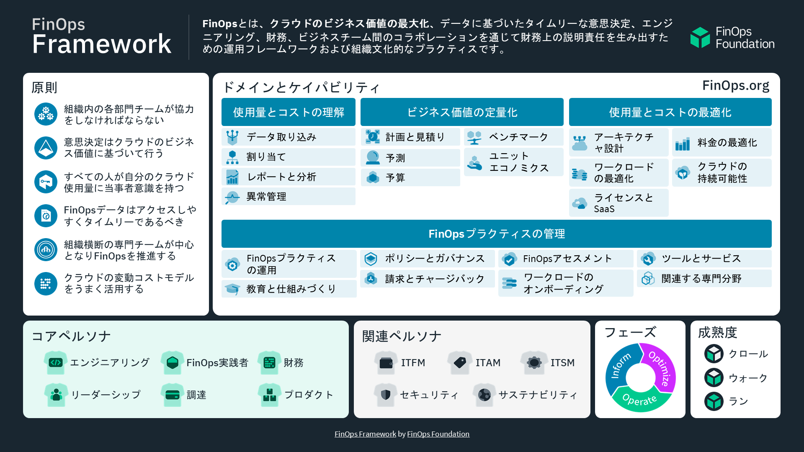


本ドキュメントは「[FinOps Foundation](https://www.finops.org/)」の「[FinOps Framework](https://www.finops.org/framework/)」を翻訳したものです。(CC BY 4.0)


## フレームワークの概要

FinOpsフレームワークは、FinOpsの実践を確立し、成功させるための運用モデルを提供します。

## フレームワークを探索する


  
  
  
  
  
  
  

